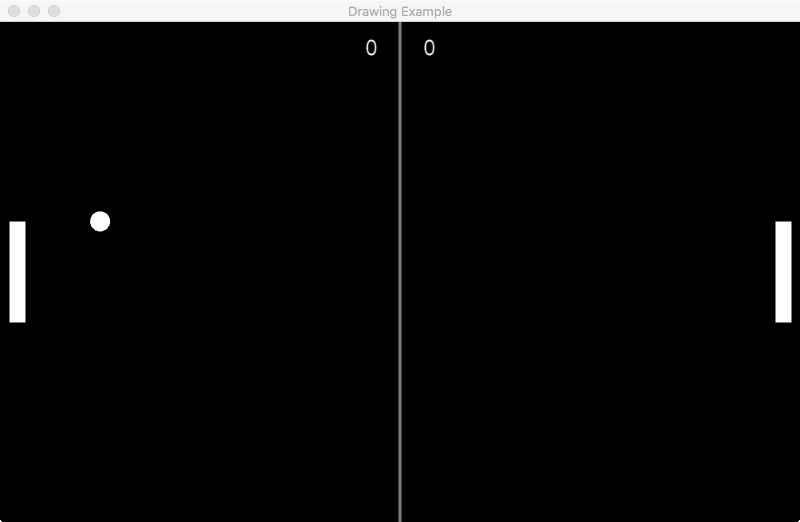

# Pong Game 

Implementación del interfaz para el juego de pong.

## Requerimientos

Se necesita:
- la versión python versión 3
- La libreria arcade
    ```bash
    python -m pip install arcade
    ```
- La libreria PySerial
    ```bash
    python -m pip install pyserial
    ```


## Método de uso
Para compilar y ejecutar la aplicación usa la siguiente comanda en el directorio base del proyecto:

```bash
python3 interface.py
```

## Cosas por implementar
- ~~OOP~~
- ~~Menú para configurar el interfaz y comunicación.~~
- ~~Lectura desde puerto UART de la placa.~~
- ~~Lectura de datos para la inicialización.~~
- ~~Interpretación de los datos recibidos desde el host(klz25)~~
- ~~Injección de los datos recibidos y actualizar las graficas.~~
